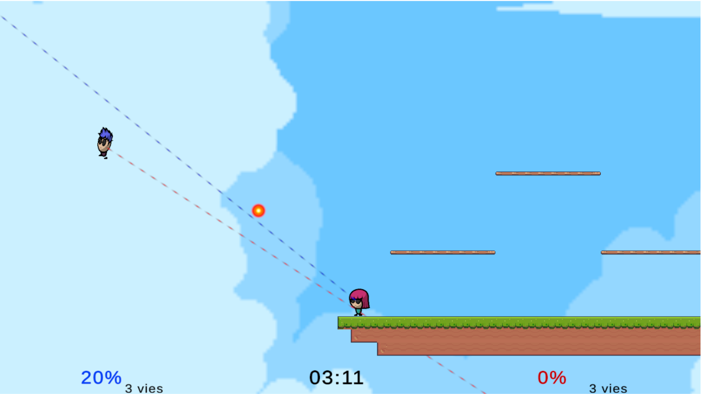
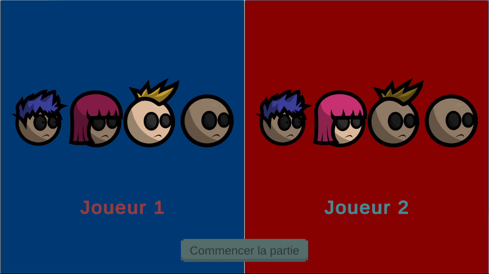
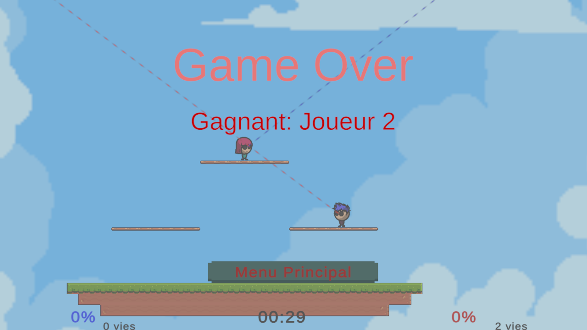

# 🧊 Bataille de bonhommes

> **Jeu PvP 2D de plateformes** — Faites tomber votre adversaire de l’arène cinq fois pour remporter la victoire!

---

## 🕹️ Présentation

**Bataille de bonhommes** est un jeu de combat compétitif sur plateformes en 2D, conçu dans un cadre éducatif. Deux joueurs s'affrontent dans une arène flottante en utilisant des attaques, des roulades, des bonds et des tirs pour éjecter l’adversaire hors du terrain. Le premier à faire tomber l’autre cinq fois gagne la partie.

---

## 📷 Captures d’écran

| Gameplay | Menu | Game Over |
|---------|------|--------|
|  |  |  |

---

## 🎮 Contrôles

**Manette uniquement :**

- 🎮 **Joystick gauche** : Déplacement
- 🕹️ **Joystick gauche (haut)** : Sauter
- 🎯 **Joystick droit** : Viser
- 🔫 **Gâchette droite** : Tirer
- 🔄 **Bouton haut** : Roulade
- ⚡ **Bouton droite** : Fonce/charge

---

## ⚙️ Installation & Lancement

### WebGL (version jouable)

Le jeu peut être joué directement dans un navigateur compatible à l'adresse suivante :  
👉 [Jouer maintenant](https://pvcat.ca)

### Localement (Unity)

1. Cloner le dépôt :
   ```
   git clone https://github.com/votre-utilisateur/bataille-de-bonhommes.git
   ```
